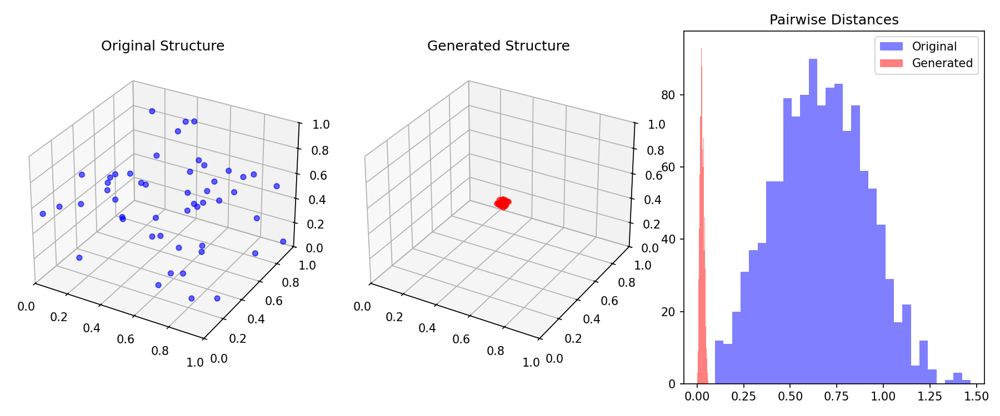

# 3D Particle Structure Generator using VAE

Generates synthetic 3D particle configurations inside a unit cube, trains a simple Variational Autoencoder (VAE) to learn their geometric distribution, and allows interactive sampling of new structures.

## What it does:
- Generates synthetic 3D particle configurations
- Trains a small VAE
- Samples new structures from the latent space
- Visualizes structure and distance distribution

## Screenshots


## How to run:
```bash
python -m venv venv
source venv/bin/activate
pip install -r requirements.txt
python train.py
streamlit run app.py
```

## Future work:
- Add stronger physical constraints
- Improve generative stability
