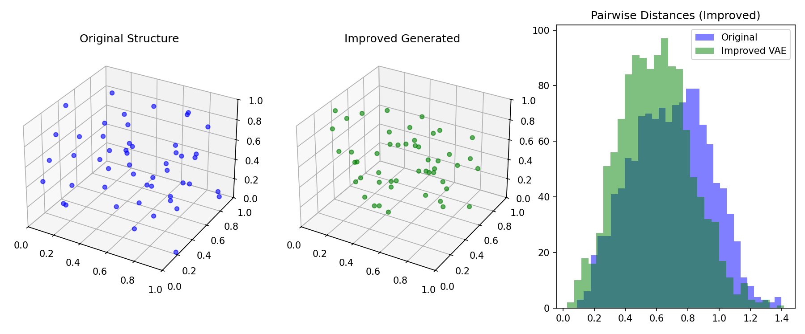

# 3D Particle Structure Generator

Simple AI project to generate 3D particle configurations inside a cube.

## Overview
- Synthetic dataset generation (50 particles in a box).
- Minimum distance constraint to prevent overlaps.
- Variational Autoencoder (VAE) built with PyTorch.
- Latent space sampling for structure generation.

## Models

### Baseline VAE
- Standard MLP architecture.
- Learned basic box constraints.
- Struggled with precise particle spacing (distribution mismatch).

### Improved VAE
- Particles sorted by coordinates to break permutation symmetry.
- Increased model capacity and latent dimension.
- Beta-VAE loss weighting for better reconstruction.
- High accuracy in pairwise distance distribution.

## Usage
- **Train:** `python train.py` and `python train_improved.py`
- **Explore:** [Jupyter Notebook](explore.ipynb)
- **Visualize:** `streamlit run app.py`

## Features
- Interactive 3D visualization.
- Pairwise distance histograms.
- Distribution comparison (Original vs Generated).
- Simple, modular code structure.
